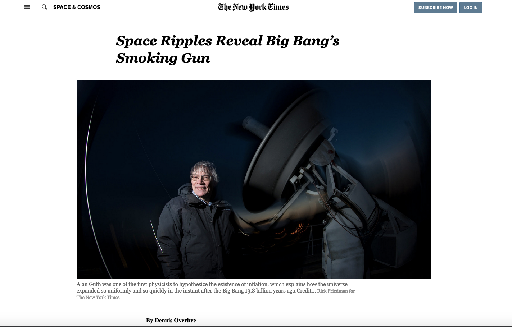

# The New York Times

> The New York Times website news page clone based on an article from [Space Ripples Reveal Big Bang’s Smoking Gun - The New York Times](https://www.nytimes.com/2014/03/18/science/space/detection-of-waves-in-space-buttresses-landmark-theory-of-big-bang.html?_r=0)

The New York Times has been a leader in experimenting with the inclusion of multimedia content in traditional stories.
We undertake this project to develop our skills in CSS3 positioning techniques.

This web page is developed by HTML5 and CSS only, without using any framework or library.

## Built With

- HTML5,
- CSS,
- Stylelint and stickler for linting purpose,
- html-validator-cli for validate HTML

## Live Demo

-  [Live Preview](https://raw.githack.com/abredi/NYTimes/feature/nytimesclone/index.html)

## Getting Started

**Install on Your Own Machine.**
**You can skip the linter and HTML validators setup if you don't want to validate the code.**

Set up your machine.

### Prerequisites

  > All the prerequisites are optional.

- Git
- HTML validator
- CSS Linter

### Setup

- Follow the link below to install git
  > [download git](https://git-scm.com/downloads)
- Follow the link below to set up an HTML validator
  > [Set up HTML validator](https://github.com/microverseinc/linters-config/tree/master/html_validator)
- Follow the link below to set up a linter
  > [Set up CSS Linter to check code errors](https://github.com/microverseinc/linters-config/tree/master/css#troubleshooting)
- Clone the repository
  > Clone the repository by run the code below on your computer terminal.
  `git clone  https://github.com/abredi/NYTimes.git`

### Install

*Optional*
Go to the project directory on your terminal and run `npm install` to install the HTML validator and CSS linter.

### Usage

Go to the project directory and run open the `index.html` file on your browser.

## Authors

👤 **Abdulaziz Ali**

- Github: [@abredi](https://github.com/abredi)
- Twitter: [@rediabdulaziz](https://twitter.com/rediabdulaziz)
- Linkedin: [linkedin](https://www.linkedin.com/in/abdulaziz-ali-98948011a)

👤 **Victor Manuel Gonzalez Buitrago**

- Github: [@Shaqri](https://github.com/Shaqri)
- Twitter: [@victorgonbu](https://twitter.com/victorgonbu)
- Linkedin: [linkedin](https://www.linkedin.com/in/victor-manuel-gonzalez-buitrago-8704731a5/)

## 🤝 Contributing

Contributions, issues and feature requests are welcome!

Feel free to check the [issues page](issues/).

## Show your support

Give a ⭐️ if you like this project!

## Acknowledgments

- [Thanks for Microverse][https://github.com/microverseinc]

## 📝 License

This project is [MIT](LICENSE) licensed.
